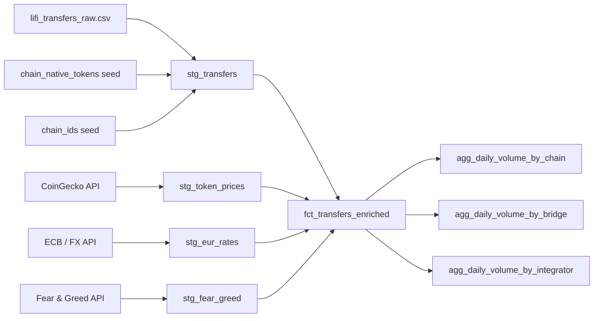

# Task 1: Analytical Data Model Design

## Overview

This document proposes an analytical data model for LI.FI bridge transfer data,
suitable for implementation in dbt or SQLMesh on top of DuckDB.

The model follows a three-layer architecture: **raw → staging → marts**.
Each layer has a single responsibility, making the pipeline easy to maintain,
test, and extend as new chains and data sources are added.

---

## Data Sources

### 1. LiFi Transfer Events (`lifi_transfers_raw.csv`)

On-chain bridge transfer events emitted by the `LiFiDiamond` contract,
sourced from Dune Analytics (`lifi_multichain.LiFiDiamond_v2_evt_LiFiTransferStarted`).

| Column | Type | Description |
|---|---|---|
| `bridgeData` | VARCHAR (JSON) | Packed JSON with transfer details — must be unpacked in staging |
| `chain` | VARCHAR | Source chain name (e.g. `gnosis`, `ethereum`, `polygon`) |
| `contract_address` | VARCHAR | LiFiDiamond contract address on the source chain |
| `evt_block_date` | DATE | Block date of the event |
| `evt_block_time` | TIMESTAMP | Exact block timestamp |
| `evt_block_number` | BIGINT | Block number |
| `evt_index` | BIGINT | Log index within the block |
| `evt_tx_hash` | VARCHAR | Transaction hash — unique identifier per transfer |
| `evt_tx_from` | VARCHAR | Wallet address that initiated the transaction |
| `evt_tx_to` | VARCHAR | Contract address the transaction was sent to |
| `evt_tx_index` | BIGINT | Transaction index within the block |

**Key nuance — `bridgeData` JSON fields:**

The `bridgeData` column is a packed JSON string containing the core transfer details.
It must be unpacked in the staging layer. Fields inside it include:

| JSON Field | Description |
|---|---|
| `transactionId` | LI.FI's internal unique ID for the transfer |
| `bridge` | Bridge protocol used (e.g. `stargateV2`, `near`, `across`) |
| `integrator` | Frontend app that routed the transfer (e.g. `jumper.exchange`, `rabbykms`) |
| `sendingAssetId` | Token contract address on the source chain — **zero-address means native token** |
| `receiver` | Destination wallet address |
| `minAmount` | Raw token amount (integer, no decimals applied) |
| `destinationChainId` | EVM chain ID of the destination chain |
| `hasSourceSwaps` | Whether a swap occurred on the source chain before bridging |
| `hasDestinationCall` | Whether a contract call is made on the destination chain |

**Critical nuance — the zero-address:**
When `sendingAssetId` is `0x0000000000000000000000000000000000000000`,
the token is the chain's native asset (e.g. xDAI on Gnosis, ETH on Ethereum, MATIC on Polygon).
This zero-address has no price entry in token price APIs, so it must be mapped to
the chain's wrapped native token address (e.g. WXDAI on Gnosis) before joining with prices.
This mapping is maintained as a dbt seed file: `seeds/chain_native_tokens.csv`.

**Critical nuance — raw token amounts:**
`minAmount` is stored as a raw integer without decimal points, as all EVM token amounts are.
For example, `210055084955942291` represents approximately `0.21 ETH` (18 decimals).
The staging model flags this column as raw; the mart divides by `10^decimals`
using decimal metadata sourced alongside token prices.

---

### 2. Token Prices in USD

Daily USD prices per token per chain, sourced from the CoinGecko API
(contract address lookup endpoint) or Dune Analytics `prices.usd`.

| Column | Type | Description |
|---|---|---|
| `chain_id` | INTEGER | EVM chain ID |
| `token_address` | VARCHAR | Token contract address (lowercase) |
| `price_date` | DATE | Date of the price observation |
| `price_usd` | DOUBLE | Token price in USD |
| `decimals` | INTEGER | Token decimal places (used to convert raw amounts) |

---

### 3. EUR Exchange Rates

Daily USD → EUR conversion rates, sourced from the ECB API or a static lookup.

| Column | Type | Description |
|---|---|---|
| `rate_date` | DATE | Date of the rate |
| `usd_to_eur` | DOUBLE | Conversion factor (multiply USD value by this) |

---

### 4. Bonus: Crypto Fear & Greed Index

Daily market sentiment score (0–100), sourced from `api.alternative.me/fng`.
Used as an enrichment dimension in the mart layer to correlate bridging
volume with market sentiment.

| Column | Type | Description |
|---|---|---|
| `date` | DATE | Date of the observation |
| `value` | INTEGER | Fear & Greed score (0 = extreme fear, 100 = extreme greed) |
| `value_classification` | VARCHAR | Label (e.g. `Fear`, `Greed`, `Neutral`) |

---

## Layer Architecture

```
┌─────────────────────────────────────────────────────────────────┐
│                          RAW LAYER                              │
│  Exact copies of source data. Never modified after ingestion.   │
│                                                                 │
│  raw_transfers │ raw_token_prices │ raw_eur_rates │ raw_fear_greed │
└────────────────────────┬────────────────────────────────────────┘
                         │ staging models clean & type-cast
┌────────────────────────▼────────────────────────────────────────┐
│                       STAGING LAYER                             │
│  One model per source. Clean types, unpack JSON, rename cols,   │
│  apply zero-address normalization. No business logic.           │
│                                                                 │
│  stg_transfers │ stg_token_prices │ stg_eur_rates │ stg_fear_greed │
└────────────────────────┬────────────────────────────────────────┘
                         │ mart models join & aggregate
┌────────────────────────▼────────────────────────────────────────┐
│                        MART LAYER                               │
│  Business-level models. Joins across sources, EUR conversion,   │
│  volume calculations, aggregations for reporting.               │
│                                                                 │
│  fct_transfers_enriched │ agg_daily_volume_by_chain             │
│  agg_daily_volume_by_bridge │ agg_daily_volume_by_integrator    │
└─────────────────────────────────────────────────────────────────┘
```

### Why this layering?

- **Raw** acts as an immutable audit trail. If a downstream model has a bug,
  raw data is always intact to reprocess from.
- **Staging** isolates source-system quirks (JSON unpacking, zero-address mapping,
  raw integer amounts) in one place. If the source schema changes, only the
  staging model needs updating.
- **Marts** contain business logic. If the definition of "volume" changes
  (e.g. use `minAmount` vs a confirmed amount), only the mart changes —
  staging is unaffected.

---

## Grain & Joins

### Transfer grain
`stg_transfers` is at **event grain**: one row per bridge transfer event,
uniquely identified by `evt_tx_hash` + `evt_index`
(a single transaction can emit multiple transfer events).

### Price grain
`stg_token_prices` is at **token-day grain**: one row per
`(chain_id, token_address, price_date)`.

### Join logic

```
stg_transfers
    JOIN stg_token_prices
        ON stg_transfers.chain = stg_token_prices.chain_id   -- mapped via seed
       AND stg_transfers.sending_asset_id_normalized = stg_token_prices.token_address
       AND stg_transfers.evt_block_date = stg_token_prices.price_date

    LEFT JOIN stg_eur_rates
        ON stg_transfers.evt_block_date = stg_eur_rates.rate_date

    LEFT JOIN stg_fear_greed
        ON stg_transfers.evt_block_date = stg_fear_greed.date
```

**Why LEFT JOIN for prices?**
An INNER JOIN would silently drop transfers where price data is unavailable
(e.g. newly listed tokens, API gaps). A LEFT JOIN keeps all transfers and
surfaces NULL volumes — making data quality visible rather than hiding it.
A dbt `warn`-severity test on `volume_usd` tracks the null rate over time.

### Chain name → Chain ID mapping
The transfers table uses chain *names* (e.g. `gnosis`) while the prices table
uses EVM chain *IDs* (e.g. `100`). A seed file `seeds/chain_ids.csv` maps
between them:

| chain_name | chain_id |
|---|---|
| ethereum | 1 |
| polygon | 137 |
| gnosis | 100 |
| arbitrum | 42161 |
| optimism | 10 |
| bsc | 56 |
| avalanche | 43114 |
| base | 8453 |

---

## EUR Conversion

The reporting currency is EUR. Conversion is applied in the mart layer:

```sql
volume_eur = (minAmount / POW(10, decimals)) * price_usd * usd_to_eur_rate
```

The EUR rate is joined on `evt_block_date`, meaning each transfer uses
the exchange rate from its own date — not a static rate. This is important
for accurate historical reporting.

If the EUR rate is missing for a given date (e.g. weekend ECB data gaps),
the model falls back to the most recent available rate using
`LAST_VALUE` over a date-ordered window.

---

## Model Diagram



---

## Mart Descriptions

### `fct_transfers_enriched`
**Grain:** One row per transfer event.
The core analytical fact table. Joins transfers with prices and exchange rates
to produce USD and EUR volumes. Retains all original transfer fields plus
enriched fields: `amount_adjusted`, `volume_usd`, `volume_eur`,
`bridge_name`, `integrator`, `destination_chain_id`, `has_source_swaps`.

### `agg_daily_volume_by_chain`
**Grain:** One row per `(source_chain, evt_block_date)`.
Daily bridging volume aggregated by source chain. Used for chain-level
trend analysis and share-of-volume reporting.

### `agg_daily_volume_by_bridge`
**Grain:** One row per `(bridge_name, evt_block_date)`.
Daily volume per bridge protocol (stargateV2, across, near, etc.).
Used to track bridge usage trends and protocol market share.

### `agg_daily_volume_by_integrator`
**Grain:** One row per `(integrator, evt_block_date)`.
Daily volume per integrator frontend (jumper.exchange, rabbykms, etc.).
Used to evaluate partner/integrator contribution to total volume.

---

## Testing Strategy

| Test | Model | Purpose |
|---|---|---|
| `unique` + `not_null` | `stg_transfers.evt_tx_hash` + `evt_index` | Ensure no duplicate events |
| `not_null` | `stg_transfers.evt_block_time` | Every transfer must have a timestamp |
| `not_null` | `stg_transfers.chain` | Every transfer must have a source chain |
| `not_null` (warn) | `fct_transfers_enriched.volume_usd` | Track price join coverage |
| `expression_is_true` | `amount_adjusted >= 0` | No negative transfer amounts |
| `relationships` | `chain` in transfers → `chain_ids` seed | All chains are mapped |

---

## What Would Be Added with More Time

- **Token metadata table** with decimals, symbol, and name per token —
  currently decimals are sourced alongside prices, but a dedicated model
  would be cleaner and reusable.
- **Destination chain enrichment** — the current model captures source chain
  volume; cross-chain flow analysis (source → destination pairs) would
  require joining destination chain IDs to the same chain reference table.
- **Incremental models** — for production use, `fct_transfers_enriched`
  would be materialized as an incremental model keyed on `evt_block_date`
  to avoid reprocessing historical data on every run.
- **Data freshness tests** — dbt source freshness checks to alert if the
  transfers table hasn't been updated within an expected window.
